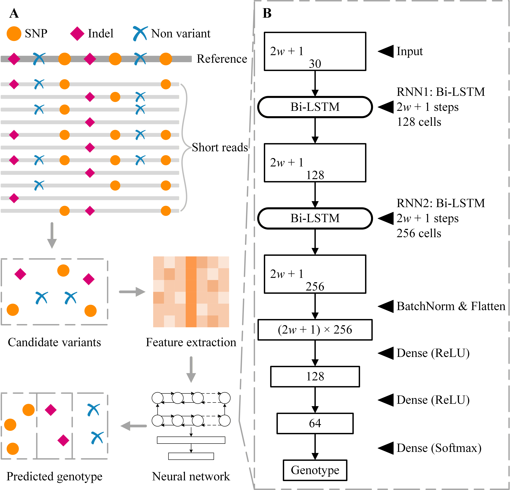

# DeepCaller

<p align="left"> 
  
  
  
  
</p>

**DeepCaller** is a deep learning–based variant caller for the accurate detection of SNPs and small indels in polyploid genomes from short-reads. It provides five pre-trained models for tetraploid and hexaploid crops and supports both speed-optimized and performance-optimized inference modes. A [Chinese tutorial](docs/README_zh.md) is also available.

> **Note**: This repository accompanies a manuscript currently under review. Full use of the software is permitted upon publication. See [LICENSE](LICENSE) for details. 

---

## 🏛️ Background

<p align="center">
  
</p>

The DeepCaller workflow comprises four sequential steps. **Step 1:** After filtering the input BAM file, DeepCaller performs per-site analysis and selects candidate variant sites based on dual thresholds on minor allele frequency and read depth. **Step 2:** Both strands of each candidate site, along with flanking bases, are encoded into a structured pileup tensor. **Step 3:** Tensors are fed into a recurrent neural network (RNN) comprising two bidirectional LSTM (Bi-LSTM) layers followed by three feedforward layers with ReLU activations, predicting genotypes across ploidy-specific categories (five for tetraploids, seven for hexaploids). **Step 4:** DeepCaller generates a VCF file from the predicted genotypes and alignment data.

---

## 🌿 Supported Species

| `--species`   | Common name                | Ploidy | Training dataset | Default |
|---------------|----------------------------|--------|------------------|---------|
| `potato`      | Tetraploid potato          | Tetraploid     | C88              | ✓ (ploidy 4) |
| `alfalfa`     | Alfalfa                    | Tetraploid     | Bolivia          | |
| `rose`        | Modern rose                | Tetraploid     | Samantha         | |
| `sweetpotato` | Sweetpotato                | Hexaploid      | Tanzania         | ✓ (ploidy 6) |
| `syn_potato`  | Synthetic hexaploid potato | Hexaploid      | SyntheticPotato  | |

> Users are encouraged to select the species model most similar to their target organism; if uncertain, the default models (`potato` for tetraploid, `sweetpotato` for hexaploid) are recommended.

---

## 🛠️ Installation

### Requirements

- Linux (x86_64)
- [Conda](https://docs.conda.io/en/latest/miniconda.html) ≥ 4.10

### Steps

```bash
# 1. Clone the repository
git clone https://github.com/JiaoLab2021/DeepCaller.git
cd DeepCaller

# 2. Create and activate the conda environment
conda env create -f deepcaller.yml
conda activate deepcaller

# 3. Install DeepCaller
pip install -e .

# 4. Verify installation
deepcaller --version
```

---

## 🚀 Quick Start

A small demo dataset (chromosome 10, 1 Mb region; tetraploid potato C88) is provided in the `demo/` directory.

```bash
cd demo

deepcaller \
    -r DM8.1_chr10_100000_1100000.fa \
    -b C88_20x_chr10_100000_1100000.bam \
    -p 4 \
    --mode speed \
    -o demo_output.vcf
```

---

## 📖 Usage

```
deepcaller -r <REF> -b <BAM> -p <PLOIDY> [options]
```

### Required arguments

| Argument | Description |
|----------|-------------|
| `-r`, `--ref` | Reference FASTA file |
| `-b`, `--bam` | Input BAM file |
| `-p`, `--ploidy` | Ploidy level: `4` or `6` |

### Input/output configuration

| Argument | Default | Description |
|----------|---------|-------------|
| `-o`, `--output` | `output.vcf` | Output VCF file (will be bgzip-compressed) |
| `-c`, `--chroms` | all | Chromosomes to process |
| `--bed` | — | BED file restricting variant calling to target regions; overrides `--chroms` |
| `-S`, `--sample` | `SAMPLE` | Sample name/id shown in the VCF `#CHROM` column line |

### Processing options

| Argument | Default | Description |
|----------|---------|-------------|
| `-s`, `--species` | auto | Species model (See Supported Species) |
| `-m`, `--mode` | `speed` | Inference mode: `speed` or `performance` |
| `-t`, `--cpus` | `24` | CPU threads; use `-1` for all available |
| `-d`, `--downsample` | off | Downsample BAM to a target depth (tetraploid: 50X, hexaploid: 80X) if the genome-wide depth exceeds it |
| `--seed` | `42` | Random seed used for `samtools view -s` downsampling |
| `--min_af` | `0.10` | Minimum allele frequency at candidate sites |
| `--rd_floor` | `10` | Minimum read depth at candidate sites |

### Example commands

```bash
# Tetraploid potato, whole genome, performance mode
deepcaller -r ref.fa -b sample.bam -p 4 --mode performance -o out.vcf -t 24

# Hexaploid sweetpotato, specific chromosomes
deepcaller -r ref.fa -b sample.bam -p 6 -c chr1 chr2 chr3 -o out.vcf

# Alfalfa, target regions only (BED file)
deepcaller -r ref.fa -b sample.bam -p 4 --species alfalfa --bed targets.bed -o out.vcf

# Custom sample name, downsample high-depth chromosomes before calling
deepcaller -r ref.fa -b sample.bam -p 4 -S MySample -d -o out.vcf
```

---

## 📄 Output

DeepCaller produces a bgzip-compressed, tabix-indexed VCF file (`<output>.gz` and `<output>.gz.tbi`).

### FORMAT fields

| Field | Description |
|-------|-------------|
| `GT`  | Polyploid genotype (e.g. `0/0/0/1` for tetraploid simplex) |
| `GQ`  | Genotype quality (Phred-scaled) |
| `DP`  | Read depth at the site |
| `AD`  | Allelic depth (ref, alt) |
| `AF`  | Allele frequency |

---

## 📝 Citation

If you use DeepCaller in your research, please cite:

> 

---

## ⚖️ License

This project is licensed under the MIT License — see [LICENSE](LICENSE) for details.  
Full use is permitted upon official publication of the accompanying manuscript.

---

## 📬 Contact

Kang Xiao · [xiaokangneuq@163.com](mailto:xiaokangneuq@163.com)
