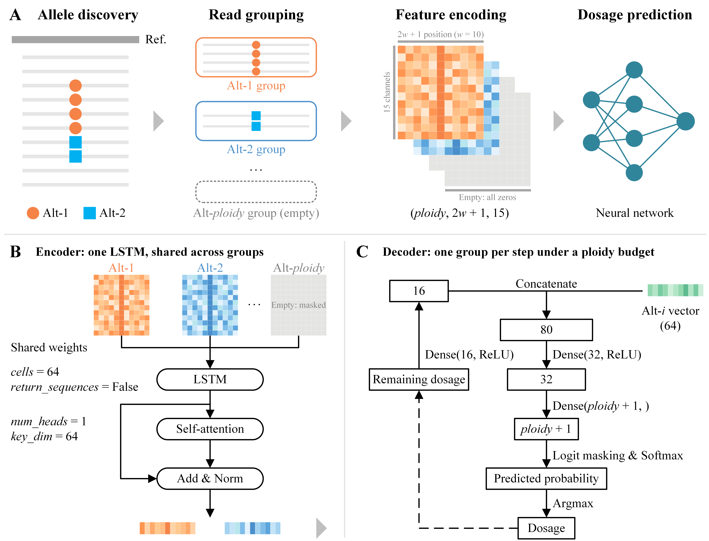

# DeepCaller

<p align="left"> 
  
  
  
  
</p>

**DeepCaller** is a deep learning–based variant caller for the accurate detection of SNPs and small indels in polyploid genomes from short-reads. It provides five pre-trained models for tetraploid and hexaploid crops and supports both speed-optimized and performance-optimized inference modes. A [Chinese tutorial](docs/README_zh.md) is also available.

> **Note**: This repository accompanies a manuscript currently under review. Full use of the software is permitted upon publication. See [LICENSE](LICENSE) for details. 

---

## 🏛️ Background

<p align="center">
  
</p>

The DeepCaller workflow comprises four sequential steps. **Step 1 — Allele discovery:** after filtering the input BAM file, DeepCaller scans each position and selects candidate variant sites using dual thresholds on alternate-allele frequency and read depth. **Step 2 — Read grouping:** the reads overlapping each candidate site are grouped by the alternate allele they support, up to the sample's ploidy. **Step 3 — Feature encoding:** the pileup of each allele-specific group, together with its flanking positions, is encoded into a structured tensor of shape (2*w* + 1) × 15. **Step 4 — Dosage prediction:** a weight-shared LSTM summarizes each group, cross-group self-attention exchanges context between groups, and a decoder assigns the copy number of each candidate allele autoregressively under a hard ploidy budget, from which the VCF is written.

---

<a id="supported-species"></a>
## 🌿 Supported Species


| `--species`             | Common name                | Ploidy     | Training dataset  | Default        |
|-------------------------|----------------------------|------------|-------------------|----------------|
| `C88_Potato`            | Tetraploid potato          | Tetraploid | C88               | ✓ (tetraploid) |
| `Bolivia_Alfalfa`       | Alfalfa                    | Tetraploid | Bolivia           | |
| `Samantha_Rose`         | Modern rose                | Tetraploid | Samantha          | |
| `SyntheticPotato_Potato`| Synthetic hexaploid potato | Hexaploid  | Synthetic hexaploid | ✓ (hexaploid) |
| `Tanzania_Sweetpotato`  | Sweetpotato                | Hexaploid  | Tanzania          | |

> If `--species` is omitted, DeepCaller uses the default model for the given ploidy (`C88_Potato` for tetraploids, `SyntheticPotato_Potato` for hexaploids). The default models generalize well across species, so they are a safe choice for genomes without a dedicated model; where a few points of accuracy matter, comparing the candidate models on a small region is worthwhile.

---

## 🛠️ Installation

### Requirements

- Linux (x86_64)
- [Conda](https://docs.conda.io/en/latest/miniconda.html) ≥ 4.10

### Steps

```bash
# 1. Clone the repository
git clone https://github.com/JiaoLab2021/DeepCaller.git
cd DeepCaller

# 2. Create and activate the conda environment
conda env create -f deepcaller.yml
conda activate deepcaller

# 3. Install DeepCaller
pip install -e .

# 4. Verify installation
deepcaller --version
```

---

## 🚀 Quick Start

A small demo dataset (chromosome 10, 1 Mb region; tetraploid potato C88) is provided in the `demo/` directory.

```bash
cd demo

deepcaller \
    -r DM8.1_chr10_100000_1100000.fa \
    -b C88_20x_chr10_100000_1100000.bam \
    -p 4 \
    -o demo_output.vcf
```

---

## 📖 Usage

```bash
deepcaller -r <REF> -b <BAM> -p <PLOIDY> [options]
```

### Required arguments

| Argument | Description |
|----------|-------------|
| `-r`, `--ref` | Reference FASTA file |
| `-b`, `--bam` | Input BAM file |
| `-p`, `--ploidy` | Ploidy level: `4` or `6` |

### Input/output configuration

| Argument | Default | Description |
|----------|---------|-------------|
| `-o`, `--out` | `output.vcf` | Output VCF file (bgzip-compressed and tabix-indexed) |
| `-c`, `--chroms` | all | Chromosomes to process |
| `-l`, `--bed` | — | BED file restricting calling to target regions; if provided, `--chroms` is ignored |
| `--sample` | `SAMPLE` | Sample name written to the VCF `#CHROM` header line |
| `--work_dir` | auto | Temporary directory; a unique directory is created under the working directory and removed on success |
| `--keep_tmp` | off | Keep the temporary directory for debugging |

### Processing options

| Argument | Default | Description |
|----------|---------|-------------|
| `--species` | ploidy-dependent | Species model (see [Supported Species](#supported-species)); default is `C88_Potato` for `-p 4` and `SyntheticPotato_Potato` for `-p 6` |
| `-t`, `--cpus` | `24` | CPU threads; use `-1` for all available |
| `--downsample` | off | Downsample the BAM to a target depth (50× for `-p 4`, 80× for `-p 6`) when the genome-wide depth exceeds it |
| `--seed` | `42` | Random seed used by `samtools view -s` for downsampling |
| `-v`, `--min_af` | `0.1` | Minimum alternate-allele fraction of a candidate allele |
| `-d`, `--rd_floor` | `8` | Minimum read depth of a candidate locus |
| `--min_mq` | `5` | Minimum mapping quality kept during pileup |
| `--max_id_len` | `50` | Maximum indel length considered as a candidate allele |
| `--batch_size` | `8192` | Model inference batch size |

### Example commands

```bash
# Tetraploid potato, whole genome, 24 threads
deepcaller -r ref.fa -b sample.bam -p 4 -o out.vcf -t 24

# Hexaploid sweetpotato model, specific chromosomes
deepcaller -r ref.fa -b sample.bam -p 6 --species Tanzania_Sweetpotato -c chr1 chr2 chr3 -o out.vcf

# Alfalfa, target regions only (BED file)
deepcaller -r ref.fa -b sample.bam -p 4 --species Bolivia_Alfalfa -l targets.bed -o out.vcf

# Custom sample name; downsample high-depth data before calling
deepcaller -r ref.fa -b sample.bam -p 4 --sample MySample --downsample -o out.vcf
```

---

## 📄 Output

DeepCaller produces a bgzip-compressed, tabix-indexed VCF file (`<output>.gz` and `<output>.gz.tbi`).

### FORMAT fields

| Field | Description |
|-------|-------------|
| `GT`  | Polyploid genotype (e.g. `0/0/0/1` for a tetraploid simplex site) |
| `GQ`  | Genotype quality |
| `DP`  | Read depth at the site |
| `AD`  | Allelic depths (reference, alternate) |
| `AF`  | Allele frequency |

---

## 📝 Citation

If you use DeepCaller in your research, please cite:

> 

---

## ⚖️ License

This project is licensed under the MIT License — see [LICENSE](LICENSE) for details.  
Full use is permitted upon official publication of the accompanying manuscript.

---

## 📬 Contact

Kang Xiao · [xiaokangneuq@163.com](mailto:xiaokangneuq@163.com)
